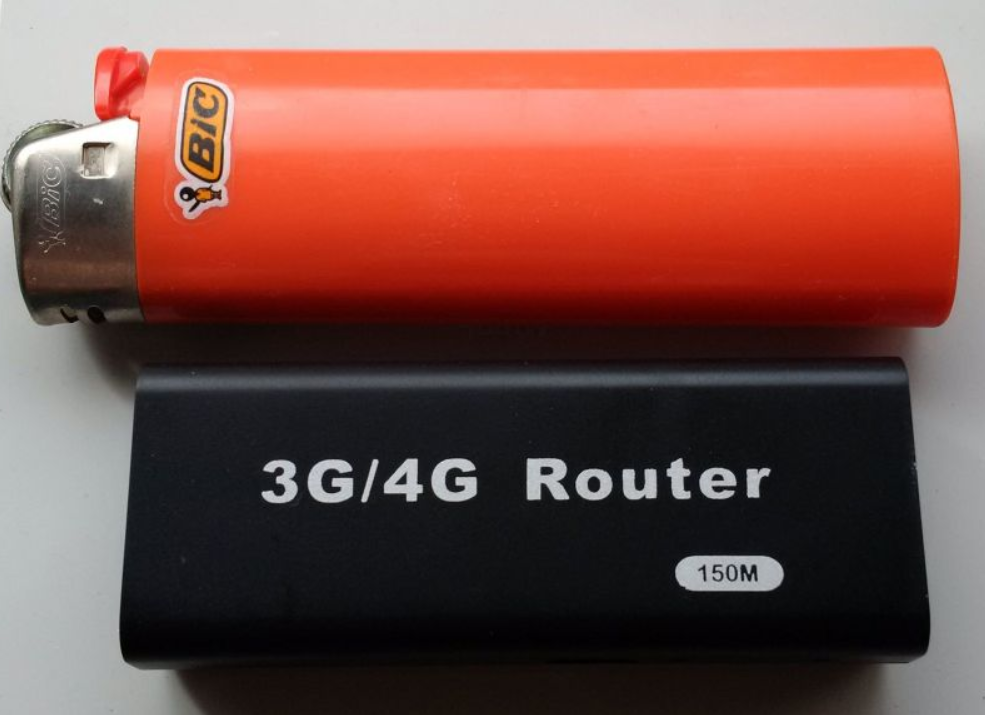

# OpenWRT Wireless attack mini-router

This is a custom OpenWRT image - CLI only - for the A5-V11 mini 3G router.

In order to bring life to this little project, basic soldering skills are required to upgrade the current eeprom SPI (flash chip) on the "A5-v11_3G_mini_router". Currently in 2023, this device can be obtained from ebay or aliexpress for around $8.

This little project allows the A5-V11 3G mini router to create an Access Point (SigDigA5V11) at boot, out of the box, becoming a Wireless swiss army tool that can be controlled from your phone running any SSH application.

Connect this access point with the password "Rockaway007$" (this is also the root password)

SSH to this Wireless attack gadget with the command:

ssh root@192.168.0.1

Once inside the device, if desired, change the wireless access point name and password. 
Enter to etc/config/wireless do the changes and reboot, done.

This image is loaded with the following features:
-
1.- Several wireless assesment tools.

aircrack-ng, airmon-ng, reaver, pixiewps, tcpdump, tmux, rtl-sdr, rtl_433, rtl_ais, iodine, privoxy, hcxdumptool, horst

Additional tools: 
netcat, fdisk, macchanger, nano

2.- Support for extension of the storage capacity with extroot (adding a USB flashdrive formated to ext4).

3.- Driver support for additional USB wireless cards adapters.
Devices based on chipset ar9271 (for instance DWA-126, WNA1100, TL-WN721N, TL-WN722N V1.x, TL-WN322G v3, TL-WN422G v2, DNUA-93F and anything azurewave and atheros ar9271) and also the chipset rt2800, for example the Ralink and Mediatek USB devices RT2770, RT2870, RT3070 RT3071, RT3072, RT3572.

4.- Wireless access point waiting for you to connect, ready to rock your attack. (Connect to SigDigA5V11)

# Installation requirements:

1.-We'll upgrade the mini router to 16MB with the chip "W25Q128". It can be found for a couple of bucks on aliexpress
https://www.aliexpress.us/item/3256804269088009.html

2.- The programer flasher ch341a with an clip adapter, which is very inexpensive and its supported for the awesome tool flashroom.

https://www.ebay.com/itm/285027193020

3.-An iron and solder

4.-A PC running linux

# Before anything (just in case):

We need to grab a copy of your original flash chip. We will not needed it for this project, but better safe than sorry. 
So, desolder/remove the flash chip from the mini router and connect it to the clip adapter from the ch341a programmer and follow below:

1.- This command will detect the flash chip (and its number) you removed from the A5-V11 mini router:

sudo apt install flashrom

sudo flashrom -p ch341a_spi 

2.- This commnad will copy the original chip's content to a file

sudo flashrom -p ch341a_spi -c <detected flash chip> -r original-fullflashchip-backup.bin 

# Firmware, Installation process:

1.- First, we need to create a blank canvas (named '16MBpadded.bin') of 16MB for the new flash chip.
running the following command:

 dd if=/dev/zero bs=1M count=16 of=16MBpadded.bin

2.- We will need a new Uboot for our Wireless attack gadget. (Thanks to Wert-Wert)

Get it from this site 
https://disk.yandex.com/d/ubSsjNZU34Xk2L 

Choose the file/image called 'Uboot_usb_256_03.img'

3.- Flash Uboot image to the new 16MB SPI. 

So, grab the "W25Q128" chip you bought. 
Connect it to the Programmer's Clip and flash the file 'Uboot_usb_256_03.img' with the following command:  

dd if=Uboot_usb_256_03.img conv=notrunc of=16MBpadded.bin

4.- Get a USB flash drive formated to FAT32.
Get the Custom OpenWRT image you built or grab the pre-made image from the release, then place it on the root directory of the USB flash drive.

5.- Connect the USB to your device.
While holding the reset button, power the A5-V11 device. (keep holding the reset button for 10 seconds, the release the button).
Your USB flash drive will light up and the OpenWRT custom image will be installed/flashed to your now ready Wireless attack gadget.

6.- Go to an Ecorp building (wink- wink)

exit
